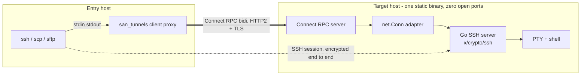
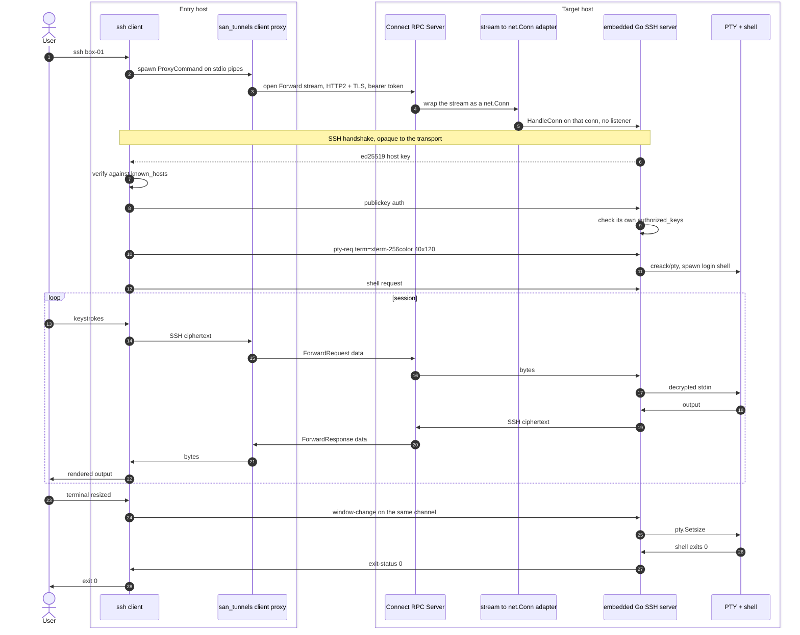
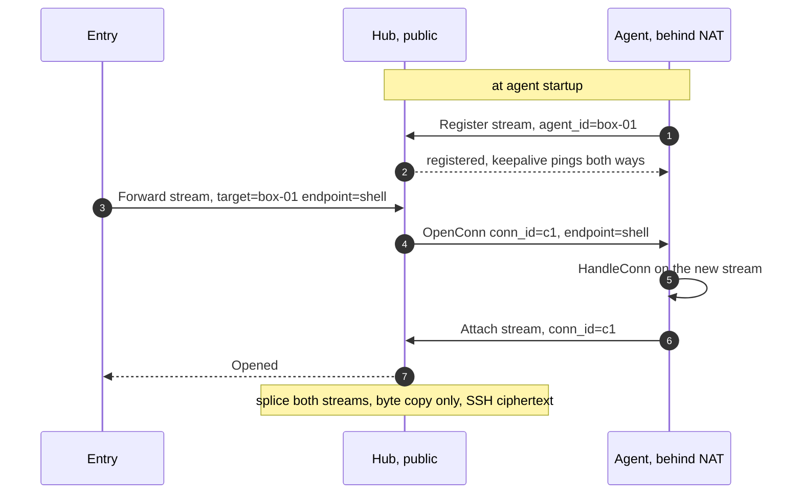
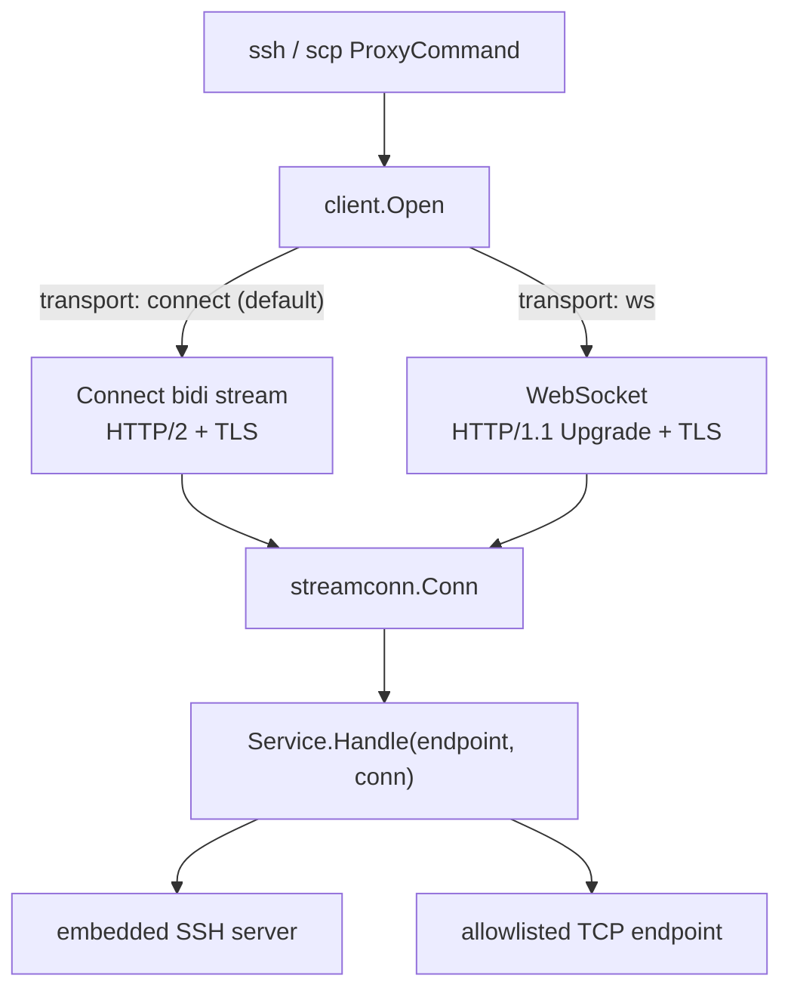

# San Tunnels

San Tunnels provides TCP tunnelling over Connect RPC, and uses that tunnel to
carry SSH sessions to hosts that do not run an SSH daemon.

There are two transports beneath it — Connect over HTTP/2 by default, and a
WebSocket over HTTP/1.1 for paths that mangle full-duplex h2 — and they meet
at `net.Conn` before anything else in the agent can tell them apart.

## General.
1. its written by golang
2. package is `github.com/wargasipil/san_tunnels`
3. folder is live in `./golang/packages/san_tunnels` as git submodule
4. we use connect rpc
5. we use buf
    - proto definition live in `./golang/packages/san_tunnels/protos`
6. no OpenSSH dependency. The SSH server is `golang.org/x/crypto/ssh`
   (via `gliderlabs/ssh`), compiled into the agent binary.
7. entry point is `./golang/packages/san_tunnels/cmd/san_tunnels`. One binary,
   two roles: `san_tunnels server` on the target, `san_tunnels client` on the
   entry host.
8. cli is `urfave/cli` v3.

## Layout.

```
golang/packages/san_tunnels/
  protos/san/tunnels/v1/tunnel.proto   TunnelService: Forward + Ping
  gen/                                 buf output (protoc-gen-go, -connect-go)
  cmd/san_tunnels/main.go              urfave/cli v3 tree
  internal/streamconn/                 net.Conn over stream callbacks
  internal/wsconn/                     net.Conn over a WebSocket, framing convention
  internal/agent/  keys.go             host key, our own authorized_keys
                   sshd.go             embedded SSH server, PTY, exec
                   service.go          Resolve + Handle, allowlist, Forward/Ping
                   ws.go               WebSocket door, duplex echo probe
                   http.go             routing, HTTP/2 enforcement, bearer token
  internal/client/ client.go           Target, Transport, Open dispatch
                   ws.go               WebSocket dial, HTTP/1.1 transport, checkWS
                   proxy.go            stdio bridge, Check
                   config.go           agent name resolution, ssh config block
  build.sh / build.ps1                 vet, test, build both binaries
```

Built and verified end to end against the real OpenSSH client, **over both
transports**: exec, exit-code propagation, interactive PTY with resize,
host-key pinning, unauthorized-key rejection, token enforcement, TCP endpoint
forwarding, half-close propagation, and HTTP/1.1 rejection on the Connect
door alongside HTTP/1.1 acceptance on the WebSocket one.

It is a git submodule as item 3 describes, tracking
`https://github.com/wargasipil/san_tunnels.git` on `main`.

## Design decisions.

**1. The tunnel carries bytes, not commands.** It moves an opaque byte stream
and never interprets it. No shell protocol of our own, no command framing.

**2. The SSH server is embedded, not installed.** `x/crypto/ssh` is a pure-Go
implementation, so the agent ships as one static binary. Nothing to install on
the target, no `openssh-server` package, no system service.

**3. The SSH server never listens on a port.** `ssh.Server` accepts a
`net.Conn`, so we wrap the Connect stream in an adapter and call `HandleConn`
directly. There is no loopback socket and no bound port; the target's network
stack exposes nothing. The only route in is the RPC endpoint behind its token.

**4. The entry point is an `ssh` ProxyCommand, not a local listener.** This is
how `ssh -J` and AWS SSM work. It keeps `known_hosts` keyed on the real target
name — a local listener would make every host look like `localhost:2222` — and
it means `scp`, `sftp`, `rsync -e ssh`, `-L`/`-R` forwards and agent forwarding
all work without us writing them.

**5. One RPC call per tunnelled TCP connection.** HTTP/2 then gives each
connection its own flow-control window, so backpressure is free and a stalled
connection cannot head-of-line block the others. Half-close falls out
naturally: the client's `CloseRequest()` surfaces as `io.EOF` in the handler,
and the handler returning ends the response stream. No connection IDs, no
multiplexer, no credit windows.

The WebSocket transport keeps the same one-call-per-connection shape — one
socket per tunnelled connection, with TCP's own window doing the
backpressure. Only half-close needs building by hand there, because
WebSocket has no frame for it; see "WebSocket transport".

## Concept.



One session, end to end:



## Protocol.

```proto
syntax = "proto3";
package san.tunnels.v1;

service TunnelService {
  // One call per tunnelled TCP connection.
  // The first client message must be `open`.
  rpc Forward(stream ForwardRequest) returns (stream ForwardResponse);
}

message ForwardRequest {
  oneof payload {
    Open  open = 1;
    bytes data = 2;
  }
}

message Open {
  // A name resolved against the agent's allowlist, never a free-form
  // host:port -- accepting an arbitrary address makes the agent an open
  // relay that any token holder can pivot through.
  //   "shell"    -> the in-process SSH server, no socket involved
  //   "postgres" -> dial 127.0.0.1:5432
  string endpoint = 1;
}

message ForwardResponse {
  oneof payload {
    Opened opened = 1;
    bytes  data   = 2;
  }
}

message Opened {}
```

`endpoint: "shell"` is the SSH case and is handled in-process. Every other
allowlisted name dials a real TCP address, which is how the same service
tunnels Postgres, Redis or an admin port.

## Agent.

Near enough the whole thing:

```go
srv := &ssh.Server{
    HostSigners: []ssh.Signer{hostKey}, // generated once, then persisted
    PublicKeyHandler: func(ctx ssh.Context, key ssh.PublicKey) bool {
        return authorized.Has(key) // our own authorized_keys, not the system one
    },
    Handler: func(s ssh.Session) {
        ptyReq, winCh, isPty := s.Pty()
        if !isPty {
            io.WriteString(s, "pty required\n")
            s.Exit(1)
            return
        }
        cmd := exec.Command(loginShell())
        cmd.Env = append(os.Environ(), "TERM="+ptyReq.Term)
        f, err := pty.Start(cmd)
        if err != nil {
            s.Exit(1)
            return
        }
        defer f.Close()

        go func() {
            for w := range winCh {
                pty.Setsize(f, &pty.Winsize{
                    Rows: uint16(w.Height), Cols: uint16(w.Width),
                })
            }
        }()
        // See "Implementation notes" below: neither copy direction can be
        // waited on naively.
        ...
    },
}

srv.HandleConn(streamConn) // instead of ListenAndServe
```

Built as `internal/agent/sshd.go`. `streamConn` is `internal/streamconn`:
roughly 60 lines wrapping the Connect stream's `Send`/`Receive` as
`Read`/`Write`, with a leftover buffer for partial reads and no-op
`SetDeadline` methods.

PTY support is `github.com/aymanbagabas/go-pty`, which covers both Unix ptys
and Windows ConPTY behind one API. `github.com/creack/pty` is Unix-only and
does not compile on Windows.

## Implementation notes.

Four things that cost real time and are invisible until they bite. All four are
covered by tests in `internal/agent`.

**gliderlabs does not initialise handler maps on the `HandleConn` path.**
`ChannelHandlers`, `RequestHandlers` and `SubsystemHandlers` are filled from
the package defaults in `ensureHandlers()`, which runs from `Serve()` — and we
never call `Serve`, because nothing listens. Leave them nil and the handshake
and authentication both succeed, then every session is rejected with
`unsupported channel type`. Set them explicitly. gliderlabs' own tests call
`ensureHandlers()` by hand before `HandleConn`, which is the tell.

**Windows ConPTY never reports EOF on its output handle.** `io.Copy(session,
pty)` returns on Unix when the shell exits and blocks forever on Windows, so
the session never closes. Wait on the *process*, then give the output copy a
short grace period to drain, and let the deferred `Close` unblock it.

**`cmd.Stdin = session` deadlocks `cmd.Wait()`.** `os/exec` runs its own copy
goroutine for a non-`*os.File` stdin and `Wait` blocks until that goroutine
finishes — which it never does, because a real ssh client holds stdin open for
the lifetime of the command. `ssh host ls` prints its output and then hangs
forever. Use `cmd.StdinPipe()` and copy into it from a goroutine; `Wait` closes
that pipe itself once the process exits.

This one is easy to miss in tests: `Session.Output()` closes stdin immediately,
so it passes against the broken code. The regression test has to hold stdin
open the way `ssh` does.

**Enter is CR, not LF.** A terminal sends `\r`. Feeding `\n` to a PTY leaves
the command sitting unsubmitted at the prompt — which looks, in a test, exactly
like a tunnel that is dropping input.

## Entry point.

`san_tunnels client proxy <host>` opens one `Forward` stream with
`endpoint: "shell"` and copies it to and from its own stdin/stdout. It renders
no UI and touches no terminal state; the `ssh` client owns all of that.

```
Host box-01
  ProxyCommand san_tunnels client proxy %h
  User deploy
```

After which `ssh box-01` works normally. `san_tunnels client config box-01`
prints that block to stdout, to paste or append.

It prints rather than edits, deliberately. `~/.ssh/config` belongs to the user,
and OpenSSH resolves each keyword first-match-wins — a `Host *` block above
ours setting `User` or `IdentityFile` would silently shadow ours, so appending
is not reliably correct and prepending fights whatever else is in the file.
Writing it properly means parsing and rewriting someone else's config, plus
marker comments to stay idempotent.

If onboarding friction ever justifies it, the upgrade is `Include`-based, not a
smarter appender: generate `~/.ssh/config.d/san_tunnels.conf`, a file we fully
own and can regenerate from the agent list, and touch `~/.ssh/config` exactly
once to add `Include ~/.ssh/config.d/*.conf` at the top if absent. Needs
OpenSSH 7.3+, which is everything since 2016, Windows included.

`%h` is the **agent name**, not a URL. The client config maps it to a server
URL and a token, which is also what makes the hub variant a config change
rather than a code change: the name resolves to the hub instead of the target.

## CLI.

`urfave/cli` v3, rooted at `cmd/san_tunnels`:

```
san_tunnels server                     run the agent (default action)
san_tunnels server authorize <pubkey>  append to our authorized_keys
san_tunnels server hostkey             print the SSH host key fingerprint
san_tunnels server fingerprint         print the SSH and TLS fingerprints to pin
san_tunnels server endpoints           list the allowlist

san_tunnels client proxy <name>        ProxyCommand: stdio <-> tunnel
san_tunnels client config <name>       print the ~/.ssh/config block
san_tunnels client check <name>        preflight probe
san_tunnels client list                configured agents, with transport
```

Flags worth fixing now:

- `server`: `--listen`, `--tls-cert` / `--tls-key` (or `--h2c` for cleartext
  behind an L4 proxy), `--token-file`, `--authorized-keys`, `--host-key`,
  `--shell`, `--endpoint`, `--ws-origin`.
- `client`: `--config`, `--token`, `--endpoint` (default `shell`),
  `--transport` (`connect` or `ws`), `--insecure` for dev only.

### `client proxy` owns stdout

Everything on stdout is tunnel bytes. A stray `fmt.Println`, a log line, a
progress message, or urfave's own help and error output lands in the middle of
the SSH handshake, and `ssh` reports something unhelpful like a bad packet
length or a protocol version mismatch. Nothing points at the real cause.

So, in `proxy` specifically:

- all logging to stderr, with stdout reserved for the stream;
- set `cmd.Writer` and `cmd.ErrWriter` to `os.Stderr` so urfave cannot print to
  stdout;
- validate flags and resolve config **before** the first byte is written, and
  exit non-zero with the message on stderr if anything is wrong.

This is the same discipline the `knowledge` MCP server needs for its JSON-RPC
stdio, and it fails the same confusing way when broken.

### v3 notes

v3 is `cli.Command` all the way down — no `cli.App` — and actions take a
context: `Action: func(ctx context.Context, cmd *cli.Command) error`, with
`root.Run(ctx, os.Args)` at the top. Thread that `ctx` into the Connect call so
`Ctrl-C` cancels the stream rather than orphaning it.

## TLS needs no setup.

`san_tunnels server` on its own generates a self-signed certificate, persists
it beside the SSH host key, prints its fingerprint, and serves HTTPS. There is
no CA to run and no ACME challenge to satisfy — which matters, because an agent
behind NAT has no public DNS name to satisfy one with.

Cleartext is still available as `--h2c`, but it has to be asked for. Falling
into it by forgetting a flag would leak the bearer token and every non-`shell`
endpoint in plaintext, so the default is the encrypted one.

Clients authenticate that certificate the same way they already authenticate
the SSH host key:

- **Pinned:** `tls_fingerprint` in the client config, from
  `san_tunnels server fingerprint`. Nothing else is accepted.
- **Trust on first use:** with nothing pinned, the first connection records the
  certificate in `known_agents.json` and says so on stderr; a different one is
  refused afterwards. This is `StrictHostKeyChecking accept-new`, and it has
  the same weakness — an attacker present for that very first connection is
  trusted from then on.
- **Normal CA verification** still applies when the agent presents a real
  certificate, so operators who already have proper PKI are not forced onto
  pinning.

A certificate is never regenerated once it exists. Doing so would change the
fingerprint and lock out every client that had pinned it.

One thing this cost: neither `http2.Transport` nor the WebSocket dialler
surfaces the error a `VerifyPeerCertificate` callback returns — the handshake
just fails and the caller sees `write envelope: EOF`. A pin mismatch is exactly
where a precise message matters most, so the rejection is captured and
substituted for the transport's generic failure.

## Trust model.

Two independent layers, deliberately:

- **Transport:** TLS on the HTTP/2 connection, plus a bearer token checked by a
  Connect interceptor. This decides who may open a tunnel at all.
- **Session:** SSH public-key auth against the agent's own `authorized_keys`,
  with the client pinning the agent's ed25519 host key via `known_hosts`. This
  decides who gets a shell.

The agent generates its host key on first run and persists it. Because the SSH
session is encrypted end to end between the user's `ssh` and the embedded
server, an intermediary that forwards the tunnel moves ciphertext it cannot
read, and host-key pinning stops it substituting its own. That property is what
makes the hub variant below safe to run on infrastructure we do not fully
trust.

## Open question: connection direction.

As drawn, the entry host dials the target, so **the target must be reachable**.
If targets sit behind NAT this has to invert: the agent dials out to a public
hub and holds a registration stream, the entry host asks the hub for a named
agent, and the hub splices the two streams.



This adds a `Register` stream per agent, an `Attach(conn_id)` call, and a
pending-connection map with a dial timeout on the hub. Nothing else changes —
the agent handler and the protocol above are identical, and the hub cannot read
the sessions it carries.

**Decide this before building**, because it determines whether the hub exists.

## Transport: HTTP/2 is not optional.

connect-go serves three protocols from one handler, but they do not have equal
streaming support:

| Protocol | Transport | Unary | Server stream | Client stream | Full-duplex bidi |
|---|---|---|---|---|---|
| Connect | HTTP/1.1 | yes | yes | yes | **no** |
| Connect | HTTP/2 | yes | yes | yes | yes |
| gRPC | HTTP/2 only | yes | yes | yes | yes |
| gRPC-Web | HTTP/1.1 or /2 | yes | yes | **no** | **no** |

**gRPC-Web is not an escape hatch.** It exists so browsers can call gRPC
services, and browsers cannot stream request bodies, so the protocol has no
client-streaming or bidirectional mode at all. `connect.WithGRPCWeb()` buys
compatibility, not duplex.

There is no HTTP/1.1 path to a tunnel. HTTP/1.1 cannot interleave a request
body and a response body on one connection — the request completes, then the
response begins. A tunnel needs both directions live at once (the shell writes
output while the user is still typing), so half-duplex is not a degraded mode
here, it is a non-functional one.

### How it fails, and why quietly

The loud case is fine: a connect-go client configured with `http.DefaultTransport`
over cleartext gets HTTP/1.1 and errors when opening a bidi stream. You find
that in the first five minutes.

The quiet case is an intermediary that speaks HTTP/2 to us and HTTP/1.1 to the
backend — TLS-terminating nginx, an ALB with an HTTP/1.1 target group, an
ingress controller without a gRPC annotation. Then:

1. The client's h2 handshake succeeds, so the client believes the path is fine.
2. The proxy accepts the stream and starts buffering the request body, because
   it must deliver a *complete* HTTP/1.1 request upstream.
3. Our first `Open` message never arrives, because the client will not close
   its request body — an interactive session never ends.
4. Nothing errors. The terminal simply hangs.

Known offenders: nginx `proxy_pass` (use `grpc_pass`, and `listen ... http2`),
AWS ALB unless the target group protocol version is HTTP2 or gRPC,
`ingress-nginx` without `nginx.ingress.kubernetes.io/backend-protocol: "GRPC"`.
An AWS NLB is L4 and passes through cleanly; Envoy and Traefik handle gRPC
natively.

### Preflight instead of trust

Convert the silent hang into a loud startup failure:

- **Assert server-side.** Reject any request where `r.Proto != "HTTP/2.0"` with
  an explicit error naming the problem. One line, and it turns a hang into a
  message.
- **Configure the client explicitly.** An `http2.Transport` (or `h2c` for
  cleartext) rather than `http.DefaultTransport`, so the transport is a
  decision rather than an ALPN negotiation you did not watch.
- **Run a duplex probe at agent startup.** A `Ping` bidi RPC where the client
  sends, reads a reply, then sends again, under a short timeout. A half-duplex
  path cannot complete that round trip, so the agent fails at boot with a clear
  message instead of at 2am in someone's session.

### If the path genuinely cannot carry HTTP/2

In rough order of preference:

1. **L4 passthrough** — NLB or TCP-mode proxy, with TLS terminating at the
   agent. Keeps everything above unchanged, so it stays first choice.
2. **WebSocket data path** — `Upgrade` gives real full-duplex over HTTP/1.1 and
   is allowed through far more corporate proxies than h2c. **Built; see
   "WebSocket transport" below.**
3. **Two half-duplex streams** — server-stream down, repeated unary up. Works
   over anything, at a latency and complexity cost that is hard to justify.
   Not built, and unlikely to be now that 2 exists.

Test the real deployment path before building on any of this.

## WebSocket transport.

The second door onto the same agent, for paths that cannot carry a
full-duplex HTTP/2 stream. It is a fallback, not a peer: Connect over HTTP/2
stays the default, and choosing the other is explicit.

**Why it survives what h2 does not.** A WebSocket `Upgrade` is a 1997-era
HTTP/1.1 mechanism that nginx, ALBs and corporate middleboxes have forwarded
for well over a decade. Full-duplex h2 *to the backend* is much newer and far
more often misconfigured. The failure this fixes is the silent one above: the
proxy buffers the request body, `Open` never arrives, and the terminal hangs.

### It costs little because both doors meet at `net.Conn`

Almost nothing in the agent is transport-aware. `Service.Handle` takes an
open `net.Conn` and an endpoint name and routes it; everything below —
`sshd.go`, `keys.go`, the allowlist, the whole CLI — never learns which
transport produced the conn. Adding the second door was two small adapters,
not a fork.



### The wire convention

Both halves live in `internal/wsconn` so client and agent cannot drift apart:

| Frame | Meaning |
|---|---|
| binary message | payload bytes |
| text `close-write` | half-close: the FIN WebSocket has no frame for |
| close frame | done in both directions |

The text frame is what buys **parity** with Connect. WebSocket closes
wholesale, so without it `CloseWrite` would be a silent no-op and a tunnelled
TCP service that reads to end-of-input before replying would hang forever.
Payload is always binary, so a text frame cannot collide with it.
`TestHalfCloseReachesEndpoint` runs on both transports and fails on `ws`
within seconds if that message is removed.

### Routing and the two ordering traps

- **`/ws` must sit outside the HTTP/2 assertion.** An `Upgrade` handshake is
  HTTP/1.1 by definition (RFC 6455), and Go's server does not implement the
  HTTP/2 extended CONNECT of RFC 8441, so `/ws` arrives over 1.1 or not at
  all. `requireHTTP2` exempts the prefix; rejecting it there would close the
  very door this opens. (Chrome *does* implement RFC 8441, but only when the
  server sends `SETTINGS_ENABLE_CONNECT_PROTOCOL`, which Go does not — so
  browsers fall back to 1.1 on their own, which is what we want.)
- **The token check stays inside it.** Both doors are behind the same bearer
  token; only the protocol assertion differs.

One port serves both, via ALPN: Go's TLS server advertises `h2` and
`http/1.1`, the Connect client picks h2, the WebSocket client forces
`http/1.1`. No second listener. `--h2c` is unaffected — `h2c.NewHandler` only
intercepts the h2c preface, so an ordinary `Upgrade` passes straight through.

### What it does not change

The endpoint name still comes from the allowlist, never a free-form address —
it rides in `?endpoint=` and is validated **before** the upgrade, so an
unknown name is a 404 with a readable body rather than a socket that opens
and instantly shuts. The trust model is untouched: `wss` is transport TLS,
and the SSH session inside it is still encrypted end to end between the
user's `ssh` and the embedded server.

### What it proves less about

`client check` over `ws` cannot fail the way the `Ping` probe can, because a
WebSocket is full-duplex by construction. It still establishes reachability,
that the upgrade survives whatever sits in between, and that the token is
accepted — so the CLI says exactly that and does not claim duplex:

```
ok: ws-box is reachable over websocket and accepted the token
ok: connect-box is reachable and the path is full-duplex
```

### Choosing it

Per agent, in the client config, next to the URL it applies to:

```json
{
  "agents": {
    "box-01": { "url": "https://box-01.example:8443", "token": "…", "transport": "ws" }
  }
}
```

`--transport ws` (or `SAN_TUNNELS_TRANSPORT`) overrides per invocation. The
agent takes `--ws-origin` (repeatable) for browser origins allowed to upgrade;
empty means same-origin only, which is what a Go client sending no `Origin`
gets anyway.

### Why there is deliberately no automatic fallback

Three lines in `Open` would do it — try Connect, fall back to WebSocket on
error. It is wrong here for reasons worth keeping written down.

**The trigger does not exist.** The h2 failure this guards against is not an
error, it is a hang: the handshake succeeds, the proxy buffers, `Open` never
arrives, nothing returns. So `if err != nil` never fires, and a fallback needs
a timeout instead. Short, and a slow link gets downgraded for being slow;
long, and every connection on a broken path pays it forever; cached, and
"this target is broken" becomes hidden state that never notices the repair.
There is no good number, and that is the tell: this is not the layer where
the decision belongs.

**It hides the fault from the only person who can fix it.** Whoever types
`ssh box-01` is not whoever misconfigured the ingress. Falling back silently
works for them and fails for the system: the ALB with an HTTP/1.1 target
group stays broken, no ticket gets filed, and the next service deployed
behind that proxy hits the same wall with no clue the path has a known
defect. One person's loud ten-second failure buys a fix for everything else
behind that proxy.

**It is not a lateral move.** WebSocket has no free keepalives and has to run
its own (see "Keepalives"), and it proves less in `check`. A silent downgrade
would move someone onto the weaker path without telling them.

Automatic fallback is right when the failure is fast and unambiguous and the
fallback is equivalent — TCP connect-refused to the next address, say.
Neither holds here. This is also the same judgement `client.go` already makes
in refusing `http.DefaultTransport`, whose silent h2-to-1.1 negotiation is
the exact behaviour being avoided; automating it one layer up would undo
that.

**So the manual route is signposted instead.** Refusing to automate is only
defensible if the alternative is offered, so the stalled-probe error names
the cause, the infrastructure fixes, and the way out:

```
no reply from https://box-01.example:8443 within 10s on round 1 of the duplex probe.
The connection was established, so this is usually a proxy in the path that speaks
HTTP/2 to you and HTTP/1.1 to the agent: it buffers the whole request before
forwarding, so full-duplex streams never work.
Fix the path if you can (nginx grpc_pass, an ALB target group with protocol version
HTTP2 or gRPC, backend-protocol: GRPC on an ingress, or an L4 passthrough such as an NLB).
If you cannot, this agent can use a WebSocket instead: retry with --transport ws, and
set "transport": "ws" on "box-01" in the client config to make it stick
```

`TestStalledProbeNamesTheRemedy` holds that message to it, because a
signpost nothing asserts is one that rots.

### Keepalives

HTTP/2 pings idle streams for free; a WebSocket does not, so
`internal/wsconn/keepalive.go` runs a ticker calling `websocket.Conn.Ping`
every 25s with a 10s pong deadline. **Both ends ping**, because a tunnel can
be reaped from either side and the side that notices is whichever one's path
broke.

Two distinct problems, and the second is the one worth the code:

- **Liveness.** Middleboxes reap idle NAT and proxy entries, 60s being a
  common floor. An SSH session left at a prompt is exactly the traffic shape
  they drop, so 25s sits well under it.
- **Correctness.** A peer that vanished without a FIN — a slept laptop, an
  expired NAT entry — is indistinguishable from an idle one. Reads block
  forever and the session wedges. An unanswered ping is the only way to tell
  them apart, which is why a failed ping calls `CloseNow` rather than just
  returning: the read above has to error so `io.Copy` unblocks and the session
  actually ends.

Two constraints from the library. `Ping` does not read — it waits for the
reader to deliver the pong — so it must run concurrently with one, which every
tunnel here has by construction. And the goroutine is tied to a context
cancelled by `Close`, or every finished tunnel leaks one.

### Open question: browser credentials

A browser cannot set `Authorization` on `new WebSocket(url)`, so the header
path that works for the Go client is unreachable from a page. Three options,
best first: a short-lived ticket minted by a unary RPC and passed as
`?ticket=`; subprotocol smuggling via `Sec-WebSocket-Protocol`, as Kubernetes
does; or `?token=`, which leaks into access logs, proxy logs and browser
history and is therefore dev-only.

Unresolved because it depends on a prior question: whether a browser terminal
runs SSH in JS/WASM — keeping the session encrypted end to end and the trust
model intact — or the agent terminates SSH and ships raw PTY bytes, which is
far simpler but makes the agent see plaintext and the hub something you must
trust. **Decide that before building the browser path.**

## Notes.

- Flush every write. An interactive session is latency-bound; do not batch for
  throughput.
- HTTP/2 pings on idle streams, plus backoff-reconnect on the agent's
  registration stream. Idle tunnels get reaped by middleboxes at 60s or less.
  The WebSocket transport does this by hand in `internal/wsconn/keepalive.go`
  — see below — so the two doors no longer differ here.
- A dropped connection kills the session. Session resumption is out of scope —
  run `tmux` on the target.
- `github.com/pkg/sftp` registered as an SSH subsystem gives both `sftp` and
  `scp` (OpenSSH 9+ `scp` speaks SFTP underneath).
