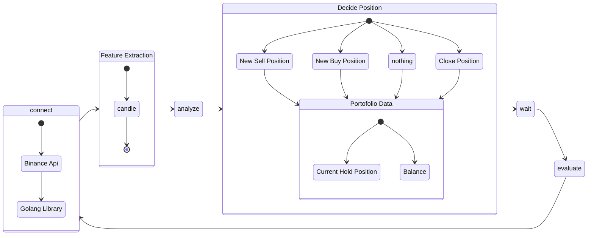

# Trading In Binance Powered By AI

## General.
1. for testing, we use test network.

## Basic Flow.

```mermaid
stateDiagram-v2
direction LR

state connect {
    state "Binance Api" as source
    state "Golang Library" as lib

    [*]-->source
    source-->lib

}

feature: Feature Extraction
state feature {
    [*]-->candle
    candle-->[*]
}

porto: Portofolio Data
state porto {
    state "Current Hold Position" as hold
    state "Balance" as balance

    [*]-->balance
    [*]-->hold
}

decide: Decide Position
state decide {
    state "New Sell Position" as newsell
    state "New Buy Position" as newbuy
    state "Close Position" as closepos

    [*]-->newsell
    [*]-->newbuy
    [*]-->nothing
    [*]-->closepos

    newsell-->porto
    newbuy-->porto
    nothing-->porto
    closepos-->porto
}

connect-->feature
feature-->analyze
analyze-->decide
decide-->wait
wait-->evaluate
evaluate-->connect

```