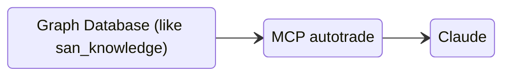
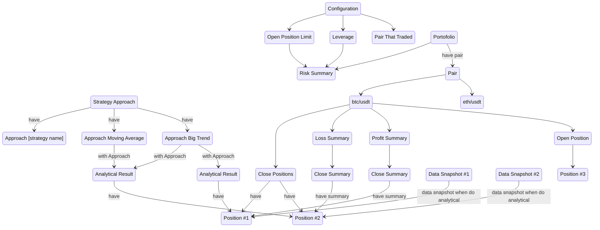

# Graph Knowledge Format Reference

## How Agent/Claude Access It

```mermaid
stateDiagram-v2
direction LR

state "Claude" as c
state "MCP autotrade" as mcp
state "Graph Database (like san_knowledge)" as db

mcp-->c
db-->mcp


```

## How We Extract Trade Knowledge Format

```mermaid
stateDiagram-v2

state "Configuration" as cfg
state "Open Position Limit" as limit
state "Leverage" as level
state "Pair That Traded" as tradepair
state "Risk Summary" as risk

cfg-->limit
cfg-->level
cfg-->tradepair

limit-->risk
level-->risk
porto-->risk


state "Close Positions" as close

state "Strategy Approach" as appr
state "Approach [strategy name]" as apprn
state "Approach Moving Average" as apprm
state "Approach Big Trend" as apprt

appr-->apprn: have
appr-->apprm: have
appr-->apprt: have

state "Position #1" as cpos1
state "Position #2" as cpos2

state "Analytical Result" as analytic1
state "Analytical Result" as analytic2

close-->cpos1: have
analytic1-->cpos1: have

analytic2-->cpos2: have


state "Close Summary" as csum1
state "Close Summary" as csum2

loss-->csum2
csum2-->cpos2: have summary
close-->cpos2: have

prf-->csum1
csum1-->cpos1: have summary


apprm-->analytic2: with Approach
apprt-->analytic2: with Approach
apprt-->analytic1: with Approach

state "Data Snapshot #1" as data1
state "Data Snapshot #2" as data2

data1-->cpos1: data snapshot when do analytical
data2-->cpos2: data snapshot when do analytical

state "Portofolio" as porto
state "Pair" as pair
state "btc/usdt" as btcusdt
state "eth/usdt" as ethusdt

state "Loss Summary" as loss
state "Profit Summary" as prf

porto-->pair: have pair
pair-->btcusdt
pair-->ethusdt

btcusdt-->close

btcusdt-->loss
btcusdt-->prf

state "Open Position" as openp
state "Position #3" as opos3

btcusdt-->openp
openp-->opos3


```