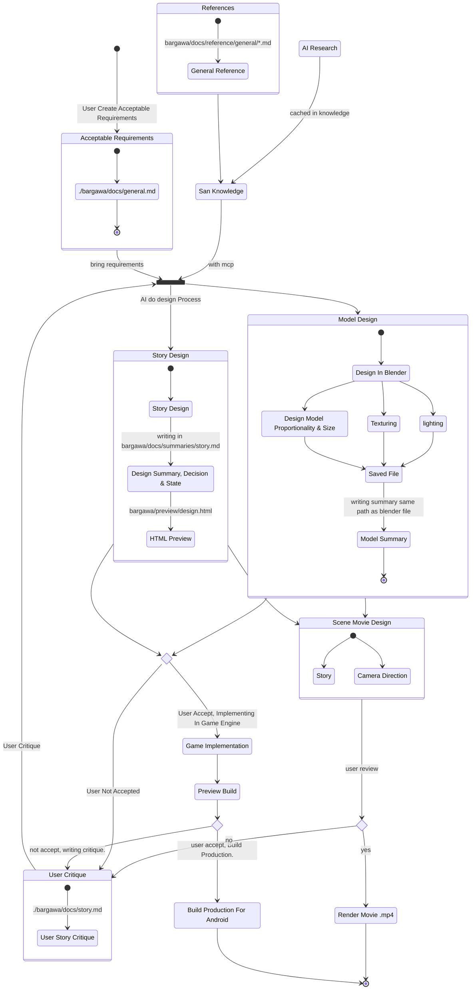

# Develop Adroid Game that adapt bargawa grief story.

## Workflow.

```mermaid

stateDiagram-v2

state "San Knowledge" as knowledge
state des_join <<join>>

references: References
state references {
    state "General Reference" as general
    [*]-->general: bargawa/docs/reference/general/*.md
}

references-->knowledge

state "AI Research" as airesearched
airesearched-->knowledge: cached in knowledge

knowledge-->des_join: with mcp

[*]-->accept: User Create Acceptable Requirements

critique: User Critique
state critique {
    state "User Story Critique" as cstory
    [*]-->cstory: ./bargawa/docs/story.md
}

accept: Acceptable Requirements
state accept {
    state "./bargawa/docs/general.md" as gen
    

    [*]-->gen
    gen-->[*]

}


accept-->des_join: bring requirements
critique-->des_join: User Critique

des_join-->design: AI do design Process
des_join-->model_design

state daccept_if <<choice>>

model_design: Model Design
state model_design {
    state "Design Model Proportionality & Size" as propor
    state "Texturing" as texturing
    state "Design In Blender" as blender
    state "Saved File" as msaved
    state "Model Summary" as msum

    [*]-->blender
    blender-->propor
    blender-->texturing
    blender-->lighting

    propor-->msaved
    texturing-->msaved
    lighting-->msaved
    msaved-->msum: writing summary same path as blender file
    msum-->[*]
}

model_design-->daccept_if


design: Story Design
state design {
    state "Story Design" as story
    state "Design Summary, Decision & State" as dsum
    state "HTML Preview" as dpreview
    

    [*]-->story

    story-->dsum: writing in bargawa/docs/summaries/story.md
    dsum-->dpreview: bargawa/preview/design.html
    
}

state approved_if <<choice>>
scene: Scene Movie Design
state scene{
    state "Story" as sstory
    state "Camera Direction" as cdirect
    [*]-->sstory
    [*]-->cdirect
}
state "Render Movie .mp4" as render

model_design-->scene
design-->scene
scene-->approved_if: user review
approved_if-->critique: no
approved_if-->render: yes
render-->[*]

design-->daccept_if
daccept_if-->impl: User Accept, Implementing In Game Engine
daccept_if-->critique: User Not Accepted


state "Game Implementation" as impl
state "Preview Build" as gprev
state "Build Production For Android" as prodbuild
state prod_if <<choice>>

impl-->gprev
gprev-->prod_if
prod_if-->prodbuild: user accept, Build Production.
prod_if-->critique: not accept, writing critique.
prodbuild-->[*]

```